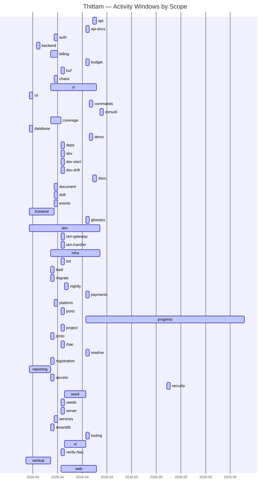

# Thittam — Progress Chart

_Auto-generated 2026-06-05T06:37:44+00:00. Regenerated nightly at 21:00 EST._

Features are GitHub issues/PRs from [`wegofwd2020-hub/thittam`](https://github.com/wegofwd2020-hub/thittam). Areas are conventional-commit scopes. Script: `scripts/generate_progress.py`.

## Activity by area (service / scope)

## Scope summary

| Scope | Commits | First | Last | Issues touched |
|---|---|---|---|---|
| `progress` | 48 | 2026-04-20 | 2026-06-04 | 0 |
| `iam` | 21 | 2026-04-04 | 2026-04-24 | 11 |
| `infra` | 15 | 2026-04-10 | 2026-04-24 | 4 |
| `frontend` | 14 | 2026-04-04 | 2026-04-11 | 11 |
| `ci` | 6 | 2026-04-10 | 2026-04-23 | 3 |
| `ui` | 5 | 2026-04-14 | 2026-04-20 | 4 |
| `vertical` | 5 | 2026-04-03 | 2026-04-10 | 3 |
| `web` | 4 | 2026-04-13 | 2026-04-23 | 1 |
| `lint` | 4 | 2026-04-13 | 2026-04-13 | 2 |
| `rbac` | 4 | 2026-04-13 | 2026-04-13 | 4 |
| `seed` | 3 | 2026-04-14 | 2026-04-20 | 3 |
| `dev-start` | 3 | 2026-04-13 | 2026-04-13 | 0 |
| `verify-rbac` | 3 | 2026-04-13 | 2026-04-13 | 0 |
| `billing` | 3 | 2026-04-10 | 2026-04-12 | 1 |
| `readme` | 2 | 2026-04-20 | 2026-04-21 | 1 |
| `doc-drift` | 2 | 2026-04-13 | 2026-04-13 | 1 |
| `coverage` | 2 | 2026-04-10 | 2026-04-13 | 1 |
| `platform` | 2 | 2026-04-11 | 2026-04-12 | 1 |
| `proto` | 2 | 2026-04-10 | 2026-04-11 | 1 |
| `reporting` | 2 | 2026-04-04 | 2026-04-10 | 2 |
| `security` | 1 | 2026-05-13 | 2026-05-13 | 2 |
| `corsutil` | 1 | 2026-04-24 | 2026-04-24 | 0 |
| `docs` | 1 | 2026-04-22 | 2026-04-22 | 0 |
| `api` | 1 | 2026-04-22 | 2026-04-22 | 0 |
| `demo` | 1 | 2026-04-21 | 2026-04-21 | 1 |
| `commands` | 1 | 2026-04-21 | 2026-04-21 | 1 |
| `glossary` | 1 | 2026-04-20 | 2026-04-20 | 0 |
| `api-docs` | 1 | 2026-04-20 | 2026-04-20 | 0 |
| `payments` | 1 | 2026-04-20 | 2026-04-20 | 2 |
| `budget` | 1 | 2026-04-20 | 2026-04-20 | 1 |
| `tooling` | 1 | 2026-04-20 | 2026-04-20 | 5 |
| `nightly` | 1 | 2026-04-14 | 2026-04-14 | 1 |
| `iam-gateway` | 1 | 2026-04-13 | 2026-04-13 | 1 |
| `iam-handler` | 1 | 2026-04-13 | 2026-04-13 | 0 |
| `ports` | 1 | 2026-04-13 | 2026-04-13 | 0 |
| `seeds` | 1 | 2026-04-13 | 2026-04-13 | 0 |
| `deps` | 1 | 2026-04-13 | 2026-04-13 | 1 |
| `buf` | 1 | 2026-04-13 | 2026-04-13 | 1 |
| `project` | 1 | 2026-04-13 | 2026-04-13 | 1 |
| `server` | 1 | 2026-04-13 | 2026-04-13 | 1 |
| `dev` | 1 | 2026-04-13 | 2026-04-13 | 1 |
| `document` | 1 | 2026-04-11 | 2026-04-11 | 1 |
| `drift` | 1 | 2026-04-11 | 2026-04-11 | 1 |
| `chaos` | 1 | 2026-04-11 | 2026-04-11 | 1 |
| `events` | 1 | 2026-04-11 | 2026-04-11 | 1 |
| `services` | 1 | 2026-04-11 | 2026-04-11 | 1 |
| `auth` | 1 | 2026-04-11 | 2026-04-11 | 0 |
| `load` | 1 | 2026-04-10 | 2026-04-10 | 1 |
| `migrate` | 1 | 2026-04-10 | 2026-04-10 | 1 |
| `registration` | 1 | 2026-04-10 | 2026-04-10 | 1 |
| `secrets` | 1 | 2026-04-10 | 2026-04-10 | 1 |
| `tenantdb` | 1 | 2026-04-10 | 2026-04-10 | 0 |
| `backend` | 1 | 2026-04-06 | 2026-04-06 | 0 |
| `cli` | 1 | 2026-04-04 | 2026-04-04 | 1 |
| `database` | 1 | 2026-04-04 | 2026-04-04 | 0 |

## Feature summary (by issue)

| Issue | Title | State | Commits | First | Last | Scopes |
|---|---|---|---|---|---|---|
| [#60](https://github.com/wegofwd2020-hub/thittam/issues/60) | feat(api): REST→gRPC bridge — grpc-gateway in services + Kong in local | OPEN | 8 | 2026-04-13 | 2026-04-13 | iam, iam-gateway, web |
| [#92](https://github.com/wegofwd2020-hub/thittam/issues/92) | feat(iam): scheduled tenant retention sweeper (suspended → deactivated | OPEN | 5 | 2026-04-21 | 2026-04-23 | iam |
| [#61](https://github.com/wegofwd2020-hub/thittam/issues/61) | feat(onboarding): capture company address + country-driven primary cur | OPEN | 3 | 2026-04-14 | 2026-04-14 | iam, seed |
| [#23](https://github.com/wegofwd2020-hub/thittam/issues/23) | [P2] Add load and chaos testing for the double-entry ledger and concur | CLOSED | 3 | 2026-04-04 | 2026-04-11 | chaos, frontend, load |
| [#19](https://github.com/wegofwd2020-hub/thittam/issues/19) | [P1] Document NATS JetStream dead-letter strategy for financial events | CLOSED | 3 | 2026-04-04 | 2026-04-11 | events, infra |
| [#17](https://github.com/wegofwd2020-hub/thittam/issues/17) | [P1] Raise test coverage targets: 800+ tests with per-service threshol | CLOSED | 3 | 2026-04-04 | 2026-04-11 | coverage, services |
| [#16](https://github.com/wegofwd2020-hub/thittam/issues/16) | [P1] Add CI test suite for vertical plugin YAML schema validation | CLOSED | 3 | 2026-04-04 | 2026-04-10 | iam, vertical |
| [#58](https://github.com/wegofwd2020-hub/thittam/issues/58) | ci(lint): fix 49 findings exposed by golangci-lint v2 (errcheck + stat | CLOSED | 2 | 2026-04-13 | 2026-04-13 | lint |
| [#57](https://github.com/wegofwd2020-hub/thittam/issues/57) | ci(doc-drift): Documentation Drift Check fails to checkout thittam_doc | CLOSED | 2 | 2026-04-13 | 2026-04-13 | doc-drift |
| [#55](https://github.com/wegofwd2020-hub/thittam/issues/55) | ci(lint): golangci-lint binary built on Go 1.24 fails on Go 1.25 targe | CLOSED | 2 | 2026-04-13 | 2026-04-14 | lint, nightly |
| [#52](https://github.com/wegofwd2020-hub/thittam/issues/52) | verify(rbac): end-to-end dev rollout verification of PROJECT_SCOPED_RB | CLOSED | 2 | 2026-04-13 | 2026-04-13 | rbac, server |
| [#47](https://github.com/wegofwd2020-hub/thittam/issues/47) | feat(rbac): expand RequirePermission coverage to all mutating RPCs in  | CLOSED | 2 | 2026-04-13 | 2026-04-13 | project, rbac |
| [#46](https://github.com/wegofwd2020-hub/thittam/issues/46) | feat(rbac): wire IAM client into project-scoped services + PROJECT_SCO | CLOSED | 2 | 2026-04-13 | 2026-04-13 | rbac |
| [#44](https://github.com/wegofwd2020-hub/thittam/issues/44) | chore(dev): separate DB lifecycle from app startup; add per-test DB sc | CLOSED | 2 | 2026-04-13 | 2026-04-13 | dev |
| [#31](https://github.com/wegofwd2020-hub/thittam/issues/31) | feat(infra): Prometheus alert rules for all services | CLOSED | 2 | 2026-04-04 | 2026-04-11 | frontend, infra |
| [#30](https://github.com/wegofwd2020-hub/thittam/issues/30) | feat(frontend): notifications inbox UI — in-app notification centre | CLOSED | 2 | 2026-04-04 | 2026-04-11 | frontend |
| [#28](https://github.com/wegofwd2020-hub/thittam/issues/28) | [P3] Set MinIO presigned URL window dynamically based on file size | CLOSED | 2 | 2026-04-04 | 2026-04-11 | document, frontend |
| [#27](https://github.com/wegofwd2020-hub/thittam/issues/27) | [P3] Define and document impersonation session lifecycle, maximum dura | CLOSED | 2 | 2026-04-04 | 2026-04-11 | frontend, platform |
| [#26](https://github.com/wegofwd2020-hub/thittam/issues/26) | [P3] Implement automated documentation drift detection in CI (Rule #16 | CLOSED | 2 | 2026-04-04 | 2026-04-11 | drift, frontend |
| [#25](https://github.com/wegofwd2020-hub/thittam/issues/25) | [P3] Replace bcrypt with argon2id or add per-IP rate limiting on auth  | CLOSED | 2 | 2026-04-04 | 2026-04-11 | frontend, iam |
| [#24](https://github.com/wegofwd2020-hub/thittam/issues/24) | [P2] Verify and document Istio DestinationRule ROUND_ROBIN load balanc | CLOSED | 2 | 2026-04-04 | 2026-04-10 | frontend, infra |
| [#22](https://github.com/wegofwd2020-hub/thittam/issues/22) | [P2] Evaluate tenant-per-schema scalability ceiling and document decis | CLOSED | 2 | 2026-04-04 | 2026-04-10 | frontend, migrate |
| [#21](https://github.com/wegofwd2020-hub/thittam/issues/21) | [P2] Implement and ship the billing service | CLOSED | 2 | 2026-04-04 | 2026-04-10 | billing, frontend |
| [#20](https://github.com/wegofwd2020-hub/thittam/issues/20) | [P2] Document vertical plugin YAML schema (JSON Schema or protobuf) | CLOSED | 2 | 2026-04-04 | 2026-04-10 | vertical |
| [#18](https://github.com/wegofwd2020-hub/thittam/issues/18) | [P1] Run critical-path E2E tests on every PR, not just nightly | CLOSED | 2 | 2026-04-04 | 2026-04-10 | ci, iam |
| [#14](https://github.com/wegofwd2020-hub/thittam/issues/14) | [P0] Design and implement saga pattern for the 9-step tenant registrat | CLOSED | 2 | 2026-04-04 | 2026-04-10 | registration, reporting |
| [#102](https://github.com/wegofwd2020-hub/thittam/issues/102) | chore(security): bump Go to 1.25.10 + x/net v0.53.0 (closes #101) | MERGED | 1 | 2026-05-13 | 2026-05-13 | security |
| [#101](https://github.com/wegofwd2020-hub/thittam/issues/101) | Vulnerabilities detected in dependencies (2026-05-08) | CLOSED | 1 | 2026-05-13 | 2026-05-13 | security |
| [#100](https://github.com/wegofwd2020-hub/thittam/issues/100) | feat(iam): tenant retention lifecycle sweeper (Stages 1+2 of #92) | MERGED | 1 | 2026-04-21 | 2026-04-21 | iam |
| [#99](https://github.com/wegofwd2020-hub/thittam/issues/99) | feat(iam): UNIQUE constraint on tenants.name (case-insensitive) | MERGED | 1 | 2026-04-21 | 2026-04-21 | iam |
| [#98](https://github.com/wegofwd2020-hub/thittam/issues/98) | docs(commands): add Mermaid example to /new-adr template | MERGED | 1 | 2026-04-21 | 2026-04-21 | commands |
| [#97](https://github.com/wegofwd2020-hub/thittam/issues/97) | chore(demo): preflight smoke-test for local dev stack | MERGED | 1 | 2026-04-21 | 2026-04-21 | demo |
| [#96](https://github.com/wegofwd2020-hub/thittam/issues/96) | feat(ui): per-production budget aggregation on detail page | MERGED | 1 | 2026-04-20 | 2026-04-20 | ui |
| [#95](https://github.com/wegofwd2020-hub/thittam/issues/95) | fix(ui): replace invalid ringColor CSS prop with ring-white Tailwind c | MERGED | 1 | 2026-04-20 | 2026-04-20 | ui |
| [#94](https://github.com/wegofwd2020-hub/thittam/issues/94) | fix(ci): create local main ref so buf breaking actually finds it | MERGED | 1 | 2026-04-20 | 2026-04-20 | ci |
| [#93](https://github.com/wegofwd2020-hub/thittam/issues/93) | feat(project,ui): wire Phases + Crew tabs onto live API (Phase C part  | MERGED | 1 | 2026-04-20 | 2026-04-20 | — |
| [#88](https://github.com/wegofwd2020-hub/thittam/issues/88) | feat(seed): add seeds/template/new-tenant/ scaffold | MERGED | 1 | 2026-04-20 | 2026-04-20 | seed |
| [#78](https://github.com/wegofwd2020-hub/thittam/issues/78) | feat(ui): wire productions pages onto live API (Phase C) | MERGED | 1 | 2026-04-20 | 2026-04-20 | ui |
| [#77](https://github.com/wegofwd2020-hub/thittam/issues/77) | fix(ci): fetch full history for proto breaking-change job | MERGED | 1 | 2026-04-20 | 2026-04-20 | ci |
| [#76](https://github.com/wegofwd2020-hub/thittam/issues/76) | feat(payments): Gateway interface + stub driver (#66) | MERGED | 1 | 2026-04-20 | 2026-04-20 | payments |
| [#75](https://github.com/wegofwd2020-hub/thittam/issues/75) | chore(tooling): Phase 1 — Claude Code workflow (spec-first + slash com | MERGED | 1 | 2026-04-20 | 2026-04-20 | — |
| [#74](https://github.com/wegofwd2020-hub/thittam/issues/74) | chore(tooling): §2.2 Thittam slash commands for repeated workflows | OPEN | 1 | 2026-04-20 | 2026-04-20 | tooling |
| [#73](https://github.com/wegofwd2020-hub/thittam/issues/73) | chore(tooling): §1.3 sub-agent fleet defaults | OPEN | 1 | 2026-04-20 | 2026-04-20 | tooling |
| [#72](https://github.com/wegofwd2020-hub/thittam/issues/72) | chore(tooling): §1.2 plan-mode discipline for multi-file changes | OPEN | 1 | 2026-04-20 | 2026-04-20 | tooling |
| [#71](https://github.com/wegofwd2020-hub/thittam/issues/71) | chore(tooling): §1.1 /spec-first slash command | CLOSED | 1 | 2026-04-20 | 2026-04-20 | tooling |
| [#70](https://github.com/wegofwd2020-hub/thittam/issues/70) | chore(tooling): Phase 1 — Claude Code workflow improvements (epic) | OPEN | 1 | 2026-04-20 | 2026-04-20 | tooling |
| [#69](https://github.com/wegofwd2020-hub/thittam/issues/69) | feat(budget): wire REST gateways + live /budgets pages (Phase B) | MERGED | 1 | 2026-04-20 | 2026-04-20 | budget |
| [#68](https://github.com/wegofwd2020-hub/thittam/issues/68) | docs(readme): replace upstream golang-migrate README with Thittam over | MERGED | 1 | 2026-04-20 | 2026-04-20 | readme |
| [#67](https://github.com/wegofwd2020-hub/thittam/issues/67) | feat(seed): add XYZ Construction demo tenant | MERGED | 1 | 2026-04-20 | 2026-04-20 | seed |
| [#66](https://github.com/wegofwd2020-hub/thittam/issues/66) | feat(payments): ADR + Gateway interface design (no driver yet) | CLOSED | 1 | 2026-04-20 | 2026-04-20 | payments |
| [#65](https://github.com/wegofwd2020-hub/thittam/issues/65) | feat(ui): adopt shadcn/ui as themeable foundation | OPEN | 1 | 2026-04-14 | 2026-04-14 | ui |
| [#59](https://github.com/wegofwd2020-hub/thittam/issues/59) | ci(deps): bump grpc + go-redis to fix remaining vuln-scan findings; do | CLOSED | 1 | 2026-04-13 | 2026-04-13 | deps |
| [#56](https://github.com/wegofwd2020-hub/thittam/issues/56) | ci(buf): RPC response naming warnings break the buf lint job | CLOSED | 1 | 2026-04-13 | 2026-04-13 | buf |
| [#54](https://github.com/wegofwd2020-hub/thittam/issues/54) | ci: vuln-scan failing on Go 1.25 stdlib CVEs (GO-2026-*) | CLOSED | 1 | 2026-04-13 | 2026-04-13 | — |
| [#53](https://github.com/wegofwd2020-hub/thittam/issues/53) | ci: Test & Coverage job fails with 'no such tool covdata' on Go 1.22 t | CLOSED | 1 | 2026-04-13 | 2026-04-13 | — |
| [#51](https://github.com/wegofwd2020-hub/thittam/issues/51) | ci: run 'make test-integration' on every PR | CLOSED | 1 | 2026-04-13 | 2026-04-13 | — |
| [#50](https://github.com/wegofwd2020-hub/thittam/issues/50) | chore(proto): fix buf config so 'buf breaking' compares correctly | CLOSED | 1 | 2026-04-13 | 2026-04-13 | — |
| [#49](https://github.com/wegofwd2020-hub/thittam/issues/49) | chore(repo): gitignore service binaries left at repo root by go build | CLOSED | 1 | 2026-04-13 | 2026-04-13 | — |
| [#48](https://github.com/wegofwd2020-hub/thittam/issues/48) | test(crypto): make TestDecrypt_Tampered deterministic | CLOSED | 1 | 2026-04-13 | 2026-04-13 | — |
| [#45](https://github.com/wegofwd2020-hub/thittam/issues/45) | chore(rbac): ADR-014 cross-cutting role-name cleanup (Phase 1 leftover | CLOSED | 1 | 2026-04-13 | 2026-04-13 | rbac |
| [#43](https://github.com/wegofwd2020-hub/thittam/issues/43) | feat(services): wire project_id into permission checks across project- | CLOSED | 1 | 2026-04-13 | 2026-04-13 | iam |
| [#33](https://github.com/wegofwd2020-hub/thittam/issues/33) | feat(iam): rename system roles to generic names (ADR-014 Phase 1) | CLOSED | 1 | 2026-04-13 | 2026-04-13 | iam |
| [#32](https://github.com/wegofwd2020-hub/thittam/issues/32) | feat(infra): K8s manifests — Deployments, Services, HPA, ConfigMaps, N | CLOSED | 1 | 2026-04-11 | 2026-04-11 | infra |
| [#29](https://github.com/wegofwd2020-hub/thittam/issues/29) | feat(frontend): document management UI — file browser, upload, version | CLOSED | 1 | 2026-04-11 | 2026-04-11 | frontend |
| [#15](https://github.com/wegofwd2020-hub/thittam/issues/15) | [P1] Document and implement reporting-analytics read model strategy | CLOSED | 1 | 2026-04-10 | 2026-04-10 | reporting |
| [#13](https://github.com/wegofwd2020-hub/thittam/issues/13) | [P0] Resolve contradiction between Rule #2 (env vars) and security doc | CLOSED | 1 | 2026-04-04 | 2026-04-04 | — |
| [#7](https://github.com/wegofwd2020-hub/thittam/issues/7) | feat(ledger): Build general-ledger service — double-entry accounting | CLOSED | 1 | 2026-04-04 | 2026-04-04 | — |
| [#6](https://github.com/wegofwd2020-hub/thittam/issues/6) | feat(inventory): Complete inventory-management service — repository, g | CLOSED | 1 | 2026-04-04 | 2026-04-04 | vertical |
| [#5](https://github.com/wegofwd2020-hub/thittam/issues/5) | feat(expense): Complete expense-tracking service — repository, gRPC wi | CLOSED | 1 | 2026-04-04 | 2026-04-04 | cli |
| [#4](https://github.com/wegofwd2020-hub/thittam/issues/4) | feat(budget): Complete budget-planning service — repository, gRPC wiri | CLOSED | 1 | 2026-04-04 | 2026-04-04 | — |
| [#3](https://github.com/wegofwd2020-hub/thittam/issues/3) | feat(project): Complete project-management service — repository, gRPC  | CLOSED | 1 | 2026-04-04 | 2026-04-04 | iam |
| [#2](https://github.com/wegofwd2020-hub/thittam/issues/2) | feat(iam): Build IAM service — identity, auth, RBAC, tenancy | CLOSED | 1 | 2026-04-10 | 2026-04-10 | secrets |
| [#1](https://github.com/wegofwd2020-hub/thittam/issues/1) | chore(proto): Run buf generate and sqlc generate — shared prep work | CLOSED | 1 | 2026-04-11 | 2026-04-11 | proto |

## Redesign leaderboard

Issues/PRs referenced in 2+ commits — each extra commit is an iteration or rework.

| Issue | Title | Commits | First | Last | Span (days) |
|---|---|---|---|---|---|
| [#60](https://github.com/wegofwd2020-hub/thittam/issues/60) | feat(api): REST→gRPC bridge — grpc-gateway in services + Kon | 8 | 2026-04-13 | 2026-04-13 | 0 |
| [#92](https://github.com/wegofwd2020-hub/thittam/issues/92) | feat(iam): scheduled tenant retention sweeper (suspended → d | 5 | 2026-04-21 | 2026-04-23 | 2 |
| [#61](https://github.com/wegofwd2020-hub/thittam/issues/61) | feat(onboarding): capture company address + country-driven p | 3 | 2026-04-14 | 2026-04-14 | 0 |
| [#23](https://github.com/wegofwd2020-hub/thittam/issues/23) | [P2] Add load and chaos testing for the double-entry ledger  | 3 | 2026-04-04 | 2026-04-11 | 7 |
| [#19](https://github.com/wegofwd2020-hub/thittam/issues/19) | [P1] Document NATS JetStream dead-letter strategy for financ | 3 | 2026-04-04 | 2026-04-11 | 7 |
| [#17](https://github.com/wegofwd2020-hub/thittam/issues/17) | [P1] Raise test coverage targets: 800+ tests with per-servic | 3 | 2026-04-04 | 2026-04-11 | 7 |
| [#16](https://github.com/wegofwd2020-hub/thittam/issues/16) | [P1] Add CI test suite for vertical plugin YAML schema valid | 3 | 2026-04-04 | 2026-04-10 | 6 |
| [#58](https://github.com/wegofwd2020-hub/thittam/issues/58) | ci(lint): fix 49 findings exposed by golangci-lint v2 (errch | 2 | 2026-04-13 | 2026-04-13 | 0 |
| [#57](https://github.com/wegofwd2020-hub/thittam/issues/57) | ci(doc-drift): Documentation Drift Check fails to checkout t | 2 | 2026-04-13 | 2026-04-13 | 0 |
| [#55](https://github.com/wegofwd2020-hub/thittam/issues/55) | ci(lint): golangci-lint binary built on Go 1.24 fails on Go  | 2 | 2026-04-13 | 2026-04-14 | 1 |
| [#52](https://github.com/wegofwd2020-hub/thittam/issues/52) | verify(rbac): end-to-end dev rollout verification of PROJECT | 2 | 2026-04-13 | 2026-04-13 | 0 |
| [#47](https://github.com/wegofwd2020-hub/thittam/issues/47) | feat(rbac): expand RequirePermission coverage to all mutatin | 2 | 2026-04-13 | 2026-04-13 | 0 |
| [#46](https://github.com/wegofwd2020-hub/thittam/issues/46) | feat(rbac): wire IAM client into project-scoped services + P | 2 | 2026-04-13 | 2026-04-13 | 0 |
| [#44](https://github.com/wegofwd2020-hub/thittam/issues/44) | chore(dev): separate DB lifecycle from app startup; add per- | 2 | 2026-04-13 | 2026-04-13 | 0 |
| [#31](https://github.com/wegofwd2020-hub/thittam/issues/31) | feat(infra): Prometheus alert rules for all services | 2 | 2026-04-04 | 2026-04-11 | 7 |
| [#30](https://github.com/wegofwd2020-hub/thittam/issues/30) | feat(frontend): notifications inbox UI — in-app notification | 2 | 2026-04-04 | 2026-04-11 | 7 |
| [#28](https://github.com/wegofwd2020-hub/thittam/issues/28) | [P3] Set MinIO presigned URL window dynamically based on fil | 2 | 2026-04-04 | 2026-04-11 | 7 |
| [#27](https://github.com/wegofwd2020-hub/thittam/issues/27) | [P3] Define and document impersonation session lifecycle, ma | 2 | 2026-04-04 | 2026-04-11 | 7 |
| [#26](https://github.com/wegofwd2020-hub/thittam/issues/26) | [P3] Implement automated documentation drift detection in CI | 2 | 2026-04-04 | 2026-04-11 | 7 |
| [#25](https://github.com/wegofwd2020-hub/thittam/issues/25) | [P3] Replace bcrypt with argon2id or add per-IP rate limitin | 2 | 2026-04-04 | 2026-04-11 | 7 |
| [#24](https://github.com/wegofwd2020-hub/thittam/issues/24) | [P2] Verify and document Istio DestinationRule ROUND_ROBIN l | 2 | 2026-04-04 | 2026-04-10 | 6 |
| [#22](https://github.com/wegofwd2020-hub/thittam/issues/22) | [P2] Evaluate tenant-per-schema scalability ceiling and docu | 2 | 2026-04-04 | 2026-04-10 | 6 |
| [#21](https://github.com/wegofwd2020-hub/thittam/issues/21) | [P2] Implement and ship the billing service | 2 | 2026-04-04 | 2026-04-10 | 6 |
| [#20](https://github.com/wegofwd2020-hub/thittam/issues/20) | [P2] Document vertical plugin YAML schema (JSON Schema or pr | 2 | 2026-04-04 | 2026-04-10 | 6 |
| [#18](https://github.com/wegofwd2020-hub/thittam/issues/18) | [P1] Run critical-path E2E tests on every PR, not just night | 2 | 2026-04-04 | 2026-04-10 | 6 |
| [#14](https://github.com/wegofwd2020-hub/thittam/issues/14) | [P0] Design and implement saga pattern for the 9-step tenant | 2 | 2026-04-04 | 2026-04-10 | 6 |

## Per-scope detail

### `api`

- **Commits:** 1

### `api-docs`

- **Commits:** 1

### `auth`

- **Commits:** 1

### `backend`

- **Commits:** 1

### `billing`

- **Commits:** 3
- **Issues referenced (1):**
  - [#21](https://github.com/wegofwd2020-hub/thittam/issues/21) — [P2] Implement and ship the billing service

### `budget`

- **Commits:** 1
- **Issues referenced (1):**
  - [#69](https://github.com/wegofwd2020-hub/thittam/issues/69) — feat(budget): wire REST gateways + live /budgets pages (Phase B)

### `buf`

- **Commits:** 1
- **Issues referenced (1):**
  - [#56](https://github.com/wegofwd2020-hub/thittam/issues/56) — ci(buf): RPC response naming warnings break the buf lint job

### `chaos`

- **Commits:** 1
- **Issues referenced (1):**
  - [#23](https://github.com/wegofwd2020-hub/thittam/issues/23) — [P2] Add load and chaos testing for the double-entry ledger and concurrent expen

### `ci`

- **Commits:** 6
- **Issues referenced (3):**
  - [#18](https://github.com/wegofwd2020-hub/thittam/issues/18) — [P1] Run critical-path E2E tests on every PR, not just nightly
  - [#77](https://github.com/wegofwd2020-hub/thittam/issues/77) — fix(ci): fetch full history for proto breaking-change job
  - [#94](https://github.com/wegofwd2020-hub/thittam/issues/94) — fix(ci): create local main ref so buf breaking actually finds it

### `cli`

- **Commits:** 1
- **Issues referenced (1):**
  - [#5](https://github.com/wegofwd2020-hub/thittam/issues/5) — feat(expense): Complete expense-tracking service — repository, gRPC wiring, main

### `commands`

- **Commits:** 1
- **Issues referenced (1):**
  - [#98](https://github.com/wegofwd2020-hub/thittam/issues/98) — docs(commands): add Mermaid example to /new-adr template

### `corsutil`

- **Commits:** 1

### `coverage`

- **Commits:** 2
- **Issues referenced (1):**
  - [#17](https://github.com/wegofwd2020-hub/thittam/issues/17) — [P1] Raise test coverage targets: 800+ tests with per-service thresholds

### `database`

- **Commits:** 1

### `demo`

- **Commits:** 1
- **Issues referenced (1):**
  - [#97](https://github.com/wegofwd2020-hub/thittam/issues/97) — chore(demo): preflight smoke-test for local dev stack

### `deps`

- **Commits:** 1
- **Issues referenced (1):**
  - [#59](https://github.com/wegofwd2020-hub/thittam/issues/59) — ci(deps): bump grpc + go-redis to fix remaining vuln-scan findings; document N/A

### `dev`

- **Commits:** 1
- **Issues referenced (1):**
  - [#44](https://github.com/wegofwd2020-hub/thittam/issues/44) — chore(dev): separate DB lifecycle from app startup; add per-test DB scaffold

### `dev-start`

- **Commits:** 3

### `doc-drift`

- **Commits:** 2
- **Issues referenced (1):**
  - [#57](https://github.com/wegofwd2020-hub/thittam/issues/57) — ci(doc-drift): Documentation Drift Check fails to checkout thittam_docs (404)

### `docs`

- **Commits:** 1

### `document`

- **Commits:** 1
- **Issues referenced (1):**
  - [#28](https://github.com/wegofwd2020-hub/thittam/issues/28) — [P3] Set MinIO presigned URL window dynamically based on file size

### `drift`

- **Commits:** 1
- **Issues referenced (1):**
  - [#26](https://github.com/wegofwd2020-hub/thittam/issues/26) — [P3] Implement automated documentation drift detection in CI (Rule #16)

### `events`

- **Commits:** 1
- **Issues referenced (1):**
  - [#19](https://github.com/wegofwd2020-hub/thittam/issues/19) — [P1] Document NATS JetStream dead-letter strategy for financial events

### `frontend`

- **Commits:** 14
- **Issues referenced (11):**
  - [#21](https://github.com/wegofwd2020-hub/thittam/issues/21) — [P2] Implement and ship the billing service
  - [#22](https://github.com/wegofwd2020-hub/thittam/issues/22) — [P2] Evaluate tenant-per-schema scalability ceiling and document decision for 50
  - [#23](https://github.com/wegofwd2020-hub/thittam/issues/23) — [P2] Add load and chaos testing for the double-entry ledger and concurrent expen
  - [#24](https://github.com/wegofwd2020-hub/thittam/issues/24) — [P2] Verify and document Istio DestinationRule ROUND_ROBIN load balancing for al
  - [#25](https://github.com/wegofwd2020-hub/thittam/issues/25) — [P3] Replace bcrypt with argon2id or add per-IP rate limiting on auth endpoints
  - [#26](https://github.com/wegofwd2020-hub/thittam/issues/26) — [P3] Implement automated documentation drift detection in CI (Rule #16)
  - [#27](https://github.com/wegofwd2020-hub/thittam/issues/27) — [P3] Define and document impersonation session lifecycle, maximum duration, and 
  - [#28](https://github.com/wegofwd2020-hub/thittam/issues/28) — [P3] Set MinIO presigned URL window dynamically based on file size
  - [#29](https://github.com/wegofwd2020-hub/thittam/issues/29) — feat(frontend): document management UI — file browser, upload, versioning, e-sig
  - [#30](https://github.com/wegofwd2020-hub/thittam/issues/30) — feat(frontend): notifications inbox UI — in-app notification centre
  - [#31](https://github.com/wegofwd2020-hub/thittam/issues/31) — feat(infra): Prometheus alert rules for all services

### `glossary`

- **Commits:** 1

### `iam`

- **Commits:** 21
- **Issues referenced (11):**
  - [#3](https://github.com/wegofwd2020-hub/thittam/issues/3) — feat(project): Complete project-management service — repository, gRPC wiring, ma
  - [#16](https://github.com/wegofwd2020-hub/thittam/issues/16) — [P1] Add CI test suite for vertical plugin YAML schema validation
  - [#18](https://github.com/wegofwd2020-hub/thittam/issues/18) — [P1] Run critical-path E2E tests on every PR, not just nightly
  - [#25](https://github.com/wegofwd2020-hub/thittam/issues/25) — [P3] Replace bcrypt with argon2id or add per-IP rate limiting on auth endpoints
  - [#33](https://github.com/wegofwd2020-hub/thittam/issues/33) — feat(iam): rename system roles to generic names (ADR-014 Phase 1)
  - [#43](https://github.com/wegofwd2020-hub/thittam/issues/43) — feat(services): wire project_id into permission checks across project-scoped ser
  - [#60](https://github.com/wegofwd2020-hub/thittam/issues/60) — feat(api): REST→gRPC bridge — grpc-gateway in services + Kong in local stack
  - [#61](https://github.com/wegofwd2020-hub/thittam/issues/61) — feat(onboarding): capture company address + country-driven primary currency
  - [#92](https://github.com/wegofwd2020-hub/thittam/issues/92) — feat(iam): scheduled tenant retention sweeper (suspended → deactivated → purge)
  - [#99](https://github.com/wegofwd2020-hub/thittam/issues/99) — feat(iam): UNIQUE constraint on tenants.name (case-insensitive)
  - [#100](https://github.com/wegofwd2020-hub/thittam/issues/100) — feat(iam): tenant retention lifecycle sweeper (Stages 1+2 of #92)

### `iam-gateway`

- **Commits:** 1
- **Issues referenced (1):**
  - [#60](https://github.com/wegofwd2020-hub/thittam/issues/60) — feat(api): REST→gRPC bridge — grpc-gateway in services + Kong in local stack

### `iam-handler`

- **Commits:** 1

### `infra`

- **Commits:** 15
- **Issues referenced (4):**
  - [#19](https://github.com/wegofwd2020-hub/thittam/issues/19) — [P1] Document NATS JetStream dead-letter strategy for financial events
  - [#24](https://github.com/wegofwd2020-hub/thittam/issues/24) — [P2] Verify and document Istio DestinationRule ROUND_ROBIN load balancing for al
  - [#31](https://github.com/wegofwd2020-hub/thittam/issues/31) — feat(infra): Prometheus alert rules for all services
  - [#32](https://github.com/wegofwd2020-hub/thittam/issues/32) — feat(infra): K8s manifests — Deployments, Services, HPA, ConfigMaps, NetworkPoli

### `lint`

- **Commits:** 4
- **Issues referenced (2):**
  - [#55](https://github.com/wegofwd2020-hub/thittam/issues/55) — ci(lint): golangci-lint binary built on Go 1.24 fails on Go 1.25 target
  - [#58](https://github.com/wegofwd2020-hub/thittam/issues/58) — ci(lint): fix 49 findings exposed by golangci-lint v2 (errcheck + staticcheck + 

### `load`

- **Commits:** 1
- **Issues referenced (1):**
  - [#23](https://github.com/wegofwd2020-hub/thittam/issues/23) — [P2] Add load and chaos testing for the double-entry ledger and concurrent expen

### `migrate`

- **Commits:** 1
- **Issues referenced (1):**
  - [#22](https://github.com/wegofwd2020-hub/thittam/issues/22) — [P2] Evaluate tenant-per-schema scalability ceiling and document decision for 50

### `nightly`

- **Commits:** 1
- **Issues referenced (1):**
  - [#55](https://github.com/wegofwd2020-hub/thittam/issues/55) — ci(lint): golangci-lint binary built on Go 1.24 fails on Go 1.25 target

### `payments`

- **Commits:** 1
- **Issues referenced (2):**
  - [#66](https://github.com/wegofwd2020-hub/thittam/issues/66) — feat(payments): ADR + Gateway interface design (no driver yet)
  - [#76](https://github.com/wegofwd2020-hub/thittam/issues/76) — feat(payments): Gateway interface + stub driver (#66)

### `platform`

- **Commits:** 2
- **Issues referenced (1):**
  - [#27](https://github.com/wegofwd2020-hub/thittam/issues/27) — [P3] Define and document impersonation session lifecycle, maximum duration, and 

### `ports`

- **Commits:** 1

### `progress`

- **Commits:** 48

### `project`

- **Commits:** 1
- **Issues referenced (1):**
  - [#47](https://github.com/wegofwd2020-hub/thittam/issues/47) — feat(rbac): expand RequirePermission coverage to all mutating RPCs in project-sc

### `proto`

- **Commits:** 2
- **Issues referenced (1):**
  - [#1](https://github.com/wegofwd2020-hub/thittam/issues/1) — chore(proto): Run buf generate and sqlc generate — shared prep work

### `rbac`

- **Commits:** 4
- **Issues referenced (4):**
  - [#45](https://github.com/wegofwd2020-hub/thittam/issues/45) — chore(rbac): ADR-014 cross-cutting role-name cleanup (Phase 1 leftover)
  - [#46](https://github.com/wegofwd2020-hub/thittam/issues/46) — feat(rbac): wire IAM client into project-scoped services + PROJECT_SCOPED_RBAC r
  - [#47](https://github.com/wegofwd2020-hub/thittam/issues/47) — feat(rbac): expand RequirePermission coverage to all mutating RPCs in project-sc
  - [#52](https://github.com/wegofwd2020-hub/thittam/issues/52) — verify(rbac): end-to-end dev rollout verification of PROJECT_SCOPED_RBAC

### `readme`

- **Commits:** 2
- **Issues referenced (1):**
  - [#68](https://github.com/wegofwd2020-hub/thittam/issues/68) — docs(readme): replace upstream golang-migrate README with Thittam overview

### `registration`

- **Commits:** 1
- **Issues referenced (1):**
  - [#14](https://github.com/wegofwd2020-hub/thittam/issues/14) — [P0] Design and implement saga pattern for the 9-step tenant registration pipeli

### `reporting`

- **Commits:** 2
- **Issues referenced (2):**
  - [#14](https://github.com/wegofwd2020-hub/thittam/issues/14) — [P0] Design and implement saga pattern for the 9-step tenant registration pipeli
  - [#15](https://github.com/wegofwd2020-hub/thittam/issues/15) — [P1] Document and implement reporting-analytics read model strategy

### `secrets`

- **Commits:** 1
- **Issues referenced (1):**
  - [#2](https://github.com/wegofwd2020-hub/thittam/issues/2) — feat(iam): Build IAM service — identity, auth, RBAC, tenancy

### `security`

- **Commits:** 1
- **Issues referenced (2):**
  - [#101](https://github.com/wegofwd2020-hub/thittam/issues/101) — Vulnerabilities detected in dependencies (2026-05-08)
  - [#102](https://github.com/wegofwd2020-hub/thittam/issues/102) — chore(security): bump Go to 1.25.10 + x/net v0.53.0 (closes #101)

### `seed`

- **Commits:** 3
- **Issues referenced (3):**
  - [#61](https://github.com/wegofwd2020-hub/thittam/issues/61) — feat(onboarding): capture company address + country-driven primary currency
  - [#67](https://github.com/wegofwd2020-hub/thittam/issues/67) — feat(seed): add XYZ Construction demo tenant
  - [#88](https://github.com/wegofwd2020-hub/thittam/issues/88) — feat(seed): add seeds/template/new-tenant/ scaffold

### `seeds`

- **Commits:** 1

### `server`

- **Commits:** 1
- **Issues referenced (1):**
  - [#52](https://github.com/wegofwd2020-hub/thittam/issues/52) — verify(rbac): end-to-end dev rollout verification of PROJECT_SCOPED_RBAC

### `services`

- **Commits:** 1
- **Issues referenced (1):**
  - [#17](https://github.com/wegofwd2020-hub/thittam/issues/17) — [P1] Raise test coverage targets: 800+ tests with per-service thresholds

### `tenantdb`

- **Commits:** 1

### `tooling`

- **Commits:** 1
- **Issues referenced (5):**
  - [#70](https://github.com/wegofwd2020-hub/thittam/issues/70) — chore(tooling): Phase 1 — Claude Code workflow improvements (epic)
  - [#71](https://github.com/wegofwd2020-hub/thittam/issues/71) — chore(tooling): §1.1 /spec-first slash command
  - [#72](https://github.com/wegofwd2020-hub/thittam/issues/72) — chore(tooling): §1.2 plan-mode discipline for multi-file changes
  - [#73](https://github.com/wegofwd2020-hub/thittam/issues/73) — chore(tooling): §1.3 sub-agent fleet defaults
  - [#74](https://github.com/wegofwd2020-hub/thittam/issues/74) — chore(tooling): §2.2 Thittam slash commands for repeated workflows

### `ui`

- **Commits:** 5
- **Issues referenced (4):**
  - [#65](https://github.com/wegofwd2020-hub/thittam/issues/65) — feat(ui): adopt shadcn/ui as themeable foundation
  - [#78](https://github.com/wegofwd2020-hub/thittam/issues/78) — feat(ui): wire productions pages onto live API (Phase C)
  - [#95](https://github.com/wegofwd2020-hub/thittam/issues/95) — fix(ui): replace invalid ringColor CSS prop with ring-white Tailwind class
  - [#96](https://github.com/wegofwd2020-hub/thittam/issues/96) — feat(ui): per-production budget aggregation on detail page

### `verify-rbac`

- **Commits:** 3

### `vertical`

- **Commits:** 5
- **Issues referenced (3):**
  - [#6](https://github.com/wegofwd2020-hub/thittam/issues/6) — feat(inventory): Complete inventory-management service — repository, gRPC wiring
  - [#16](https://github.com/wegofwd2020-hub/thittam/issues/16) — [P1] Add CI test suite for vertical plugin YAML schema validation
  - [#20](https://github.com/wegofwd2020-hub/thittam/issues/20) — [P2] Document vertical plugin YAML schema (JSON Schema or protobuf)

### `web`

- **Commits:** 4
- **Issues referenced (1):**
  - [#60](https://github.com/wegofwd2020-hub/thittam/issues/60) — feat(api): REST→gRPC bridge — grpc-gateway in services + Kong in local stack

